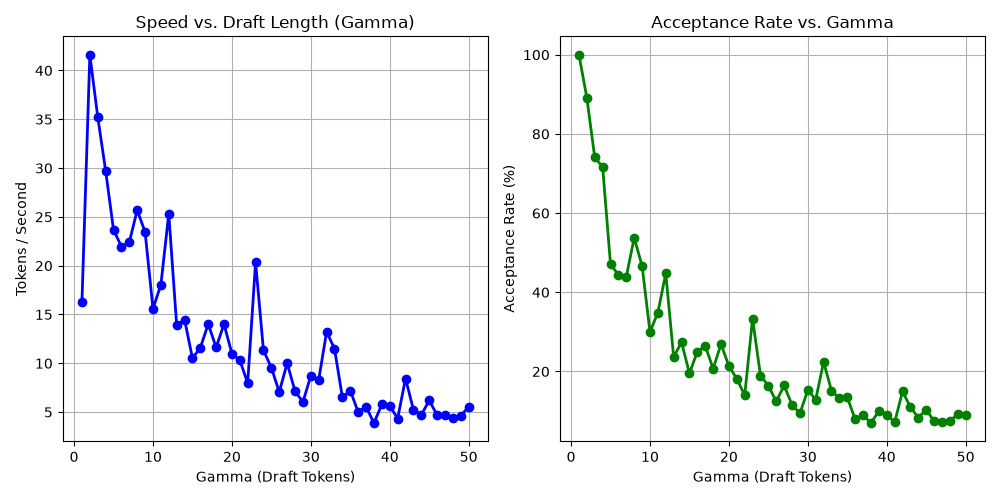
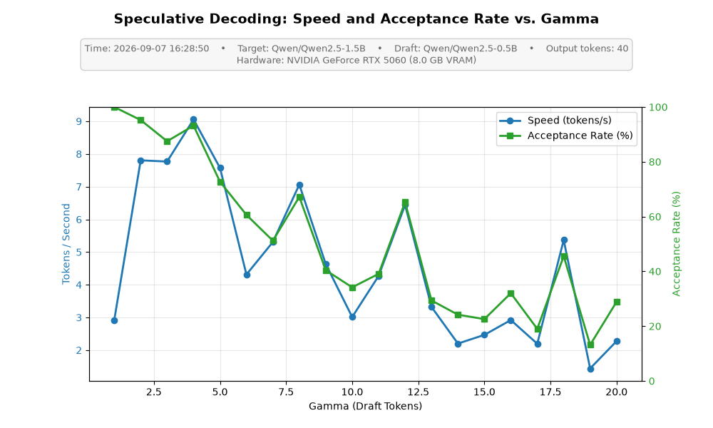

# Speculative Decoding Benchmark

## Goal

Autoregressive decoding normally emits one token per expensive target-model forward pass. Speculative decoding uses a smaller draft model to propose a short continuation, then uses one target-model verification forward pass to score every proposed position. If sufficient proposals are accepted, the target produces multiple output tokens per call without changing its intended distribution.

## Status

**In progress...**

Implemented / running:
- Draft-token generation and batched target verification.
- Throughput and draft acceptance-rate reporting.

Planned extensions:
- Auto tuning gamma for each architecture.
- GPU profiling data.
- GPU-synchronized timing, warm-up.
- Peak-VRAM, draft-time, and target-verification-time measurements.
- Greedy token-ID equality tests against target-only decoding.
- KV-cache-aware draft generation and before/after profiling.

Questions:
- [ ] Why currently SS is worst than baseline? (Tested with gamma=4, max_new_tokens=[40, 100])
    - The gap size of model target and model draft is too small
    - ~~Testing sequence length is too short~~ (Tested with longer sequence length, still worse than baseline)
    - Timing calculation logic may be a problem
        - NOTE(anhduong): can use normal timing when launch on cpu, but once it's on gpu, the timing is not accurate because of async execution. Need to use `torch.cuda.synchronize()` before and after the timing.
<!-- - [ ] Why this is not efficient using GPU?  -->


## Performance Benchmarks

| Hardware      | Target / Draft pair |      Method | Throughput (tok/s) | Mean latency (ms/token) | Speedup | Acceptance rate |  γ |
| -------- | ------------------- | ----------: | -----------------: | ----------------------: | ------: | --------------: | -: |
| Intel(R) Core(TM) i5-8350U CPU @ 1.70GHz | opt-1.3b / 125m |    Baseline |                  0.38 |                       … |   1.00× |               N/A |  — |
| Intel(R) Core(TM) i5-8350U CPU @ 1.70GHz | opt-1.3b / 125m | Speculative |                  0.60 |                       … |      1.57× |              50% |  4 |
| RTX 4090 | opt-1.3b / 125m |    Baseline |                  … |                       … |   1.00× |               N/A |  — |
| RTX 4090 | opt-1.3b / 125m | Speculative |                  … |                       … |      …× |              …% |  4 |
| RTX 5090 | Qwen2.5-1.5B / 0.5B |    Baseline |                  10.98 |                       … |      1.0× |              N/A |  4 |
| RTX 5090 | Qwen2.5-1.5B / 0.5B |    Speculative |                  7.28 |                       … |      0.66× |              …% |  4 |

<!-- | RTX 4090 | Qwen2.5-1.5B / 0.5B |    Baseline |                  … |                       … |   1.00× |               — |  — |
| RTX 4090 | Qwen2.5-1.5B / 0.5B | Speculative |                  … |                       … |      …× |              …% |  4 | -->


## Performance Breakdown
[Results](https://docs.google.com/spreadsheets/d/14b2Z0n4x0WGTn8ngUaHWemA8xh2Dzb-XaoCjBVBDvbA/edit?usp=sharing)
- Bottleneck is currently matmul in Attention op. This is pretty obvious since there's no KV cache implementation yet.

## Benchmark methodology

### Hardware and model configuration
#### Accelerator / GPU
I tested on two different NVIDIA GPUs
- NVIDIA GeForce RTX 4090, 24 GB VRAM
- NVIDIA GeForce RTX 5090, 24 GB VRAM
- Models (The draft and target models must share a tokenizer and vocabulary. Use models in the same family.)

## Quick start

```bash
git clone git@github.com:anhskrttt/speculative-decode-engine.git
cd speculative-decoding-benchmark

# Use python built-in virtual env manager
python -m venv .venv
source .venv/bin/activate
pip install -r requirements.txt

# Or use uv
uv sync
uv run python -c "import torch; print(torch.__version__); print(torch.cuda.is_available())"
```

Test:

```bash
python main.py

# OR
uv run src/python main.py
```

Run a baseline-versus-speculative comparison:

```bash
cd src
python compare.py --gamma 4 --max-new-tokens 40

# OR
uv run python src/compare.py --gamma 4 --max-new-tokens 40
```

Run the gamma sweep: By running experiments.py, choose the most efficient gamma.
TODO(anhduong): Auto choose (auto-tune) the best gamma for each model pair / architecture. 

```bash
python experiments.py
```

Expected outputs:

```text
results/gamma_analysis.png
results/gamma_results.csv
```

<!-- ## Project structure

```text
.
├── README.md
├── requirements.txt
├── src/
│   ├── config.py        # Model and sampling configuration
│   ├── baseline.py      # Target-only autoregressive decoding
│   ├── sampling.py      # Token sampling and rejection sampling
│   ├── engine.py        # Drafting and target verification loop
│   ├── compare.py       # Baseline vs. chosen gamma
│   └── experiments.py   # Gamma sweep and result plot
└── results/
    ├── gamma_analysis.png
    └── gamma_results.csv
``` -->

## Results

<!-- - The longer draft assistant's proposed squence, the worse performance (for both TPS and acceptance rate). TODO: Is there any solution? -->
<!-- - Average improvement is only aroun ~1.1x (not really significant). TODO: Why? How does it perform on different accelerators? -->

<!--  -->


## References and attribution

- Leviathan, Kalman, and Matias. [Fast Inference from Transformers via Speculative Decoding](https://arxiv.org/abs/2211.17192).
- Chen et al. [Accelerating Large Language Model Decoding with Speculative Sampling](https://arxiv.org/abs/2302.01318).
- Hugging Face. [Assisted Generation](https://huggingface.co/blog/assisted-generation).
- The initial educational implementation was informed by [kunal51107/Speculative-decoding-engine](https://github.com/kunal51107/Speculative-decoding-engine). This repository extends that starting point with a testing on GPUs, profiling, and a gamma sweep for various model architectures.